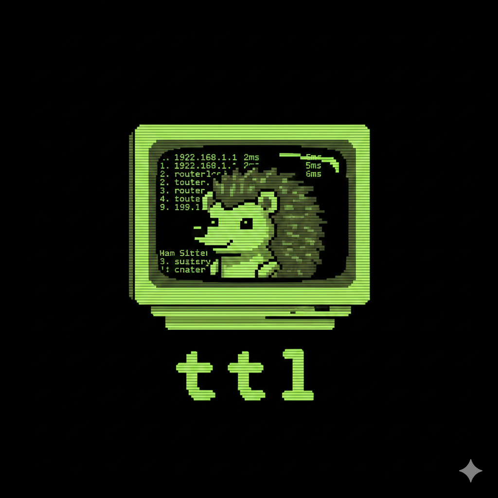

<p align="center">
  
</p>

# ttl

Network diagnostic tool that goes beyond traceroute: MTU discovery, NAT detection, route flap alerts, IX identification, and more.


[](https://crates.io/crates/ttl)
[](https://github.com/lance0/ttl/actions/workflows/ci.yml)
[](LICENSE-MIT)
[](https://ko-fi.com/lance0)

## Quick Start

```bash
# Install
cargo install ttl

# Basic usage (requires root or CAP_NET_RAW)
sudo ttl 8.8.8.8

# Common options
sudo ttl -p udp google.com           # UDP probes
sudo ttl --flows 8 cloudflare.com    # ECMP path discovery
sudo ttl --pmtud 1.1.1.1             # Path MTU discovery
sudo ttl 8.8.8.8 1.1.1.1 9.9.9.9     # Multiple targets
```

## Features

- **Fast continuous path monitoring** with detailed hop statistics
- **Multiple simultaneous targets** - trace to several destinations at once
- **Paris/Dublin traceroute** - multi-flow probing for ECMP path enumeration
- **Path MTU discovery** - binary search for maximum unfragmented size
- **NAT detection** - identify when NAT devices rewrite source ports
- **Route flap detection** - alert on path changes indicating routing instability
- **Rich enrichment** - ASN, GeoIP, reverse DNS, IX detection (PeeringDB)
- **MPLS label detection** from ICMP extensions
- **ICMP, UDP, TCP probing** with auto-detection
- **Great TUI** with themes, sparklines, and session export
- **Scriptable** - JSON, CSV, and text report output

See [docs/FEATURES.md](docs/FEATURES.md) for detailed feature documentation.

## Real-World Use Cases

### Find MTU Blackholes in VPNs

VPN tunnels often have lower MTU than expected. Large packets get silently dropped, causing mysterious connection hangs.

```bash
ttl --pmtud vpn-gateway.example.com
```

TTL binary-searches to find the maximum packet size that works. If it reports MTU of 1400 instead of 1500, you've found your blackhole. The `[MTU: 1400]` indicator in the title bar shows exactly where fragmentation occurs.

### Detect Carrier-Grade NAT Breaking Your Flows

Running multi-flow traceroute but getting inconsistent results? NAT devices may be rewriting your source ports.

```bash
ttl --flows 4 target.com
```

TTL detects when returned source ports don't match what was sent. The `[NAT]` indicator warns you, and hop details show which device is doing the rewriting. Essential for diagnosing ECMP issues behind CGNAT.

### Identify Internet Exchange Points in Your Path

See exactly where your traffic peers with other networks:

```bash
ttl cloudflare.com
```

TTL queries PeeringDB to identify IX points. When a hop IP belongs to an exchange like DE-CIX or AMS-IX, the hop detail view shows the IX name, city, and country. Useful for understanding your traffic's peering path.

### Catch Flapping Routes

Unstable BGP or failover issues cause intermittent problems that are hard to catch:

```bash
ttl -i 0.5 production-server.com
```

TTL tracks when the responding IP at a hop changes. The `!` indicator appears next to hostnames when route flaps are detected, and hop details show the change history. No more "it was fine when I checked."

### Detect Transparent Proxies and Middleboxes

Some networks intercept traffic with transparent proxies that manipulate TTL values:

```bash
ttl -p tcp --port 80 website.com
```

TTL analyzes the quoted TTL in ICMP responses. If a middlebox is intercepting traffic, the `[TTL!]` indicator appears and hop details show where TTL manipulation is occurring.

### Distinguish Real Packet Loss from ICMP Rate Limiting

That 30% packet loss at hop 5 might be fake - routers often rate-limit ICMP responses:

```bash
ttl target.com
```

TTL automatically detects rate limiting patterns. The `[RL?]` indicator and `50%RL` in the loss column tell you the "loss" is just the router deprioritizing ICMP, not actual packet drops. Stop chasing phantom problems.

### Compare Multiple Paths Simultaneously

Investigating asymmetric routing or comparing providers:

```bash
ttl 8.8.8.8 1.1.1.1 9.9.9.9
```

Trace to multiple destinations at once. Press `Tab` to switch between them. Each target maintains independent statistics - useful for A/B comparisons during network changes.

## Installation

### Quick Install (macOS/Linux)

```bash
curl -fsSL https://raw.githubusercontent.com/lance0/ttl/master/install.sh | sh
```

### Homebrew

```bash
brew install lance0/tap/ttl
```

### Pre-built Binaries

Download from [GitHub Releases](https://github.com/lance0/ttl/releases):

| Platform | Target |
|----------|--------|
| Linux x86_64 | `ttl-x86_64-unknown-linux-gnu.tar.gz` |
| Linux ARM64 | `ttl-aarch64-unknown-linux-gnu.tar.gz` |
| macOS Apple Silicon | `ttl-aarch64-apple-darwin.tar.gz` |

```bash
# Download, verify, and install (Linux x86_64 example)
curl -LO https://github.com/lance0/ttl/releases/latest/download/ttl-x86_64-unknown-linux-gnu.tar.gz
curl -LO https://github.com/lance0/ttl/releases/latest/download/SHA256SUMS
sha256sum -c SHA256SUMS --ignore-missing  # macOS: shasum -a 256 -c
tar xzf ttl-*.tar.gz && sudo mv ttl /usr/local/bin/
```

### From crates.io

```bash
cargo install ttl
```

### From Source

```bash
git clone https://github.com/lance0/ttl
cd ttl && cargo build --release
sudo cp target/release/ttl /usr/local/bin/
```

### Permissions (Linux)

Raw sockets require elevated privileges. The easiest approach is to add the capability once:

```bash
# Add capability (works for any install location)
sudo setcap cap_net_raw+ep $(which ttl)

# Then run without sudo:
ttl 8.8.8.8
```

## Usage Examples

### Interactive TUI

```bash
ttl google.com
ttl 8.8.8.8 1.1.1.1      # Multiple targets (Tab to switch)
```

### Report and Export

```bash
ttl 1.1.1.1 -c 100 --report    # Text report
ttl 1.1.1.1 -c 100 --json      # JSON export
ttl 1.1.1.1 -c 100 --csv       # CSV export
ttl --replay results.json      # Replay saved session
```

### Advanced Options

```bash
ttl -p tcp --port 443 host     # TCP probes to HTTPS
ttl --flows 4 host             # ECMP path enumeration
ttl --interface eth0 host      # Bind to interface
ttl --size 1400 host           # Large packets for MTU testing
ttl --dscp 46 host             # QoS marking (EF)
```

See [docs/FEATURES.md](docs/FEATURES.md) for full CLI reference.

## Keybindings

| Key | Action |
|-----|--------|
| `q` | Quit |
| `p` | Pause/Resume |
| `r` | Reset stats |
| `t` | Cycle theme |
| `e` | Export JSON |
| `?` | Help |
| `Tab` | Next target |
| `Enter` | Expand hop |

## Themes

11 built-in themes: `default`, `kawaii`, `cyber`, `dracula`, `monochrome`, `matrix`, `nord`, `gruvbox`, `catppuccin`, `tokyo_night`, `solarized`

```bash
ttl 1.1.1.1 --theme dracula    # Start with theme
# Press 't' to cycle themes (saved to ~/.config/ttl/config.toml)
```

## Platform Support

| Platform | Status |
|----------|--------|
| Linux | Full support |
| macOS (Tahoe 26+) | Full support |
| macOS (Sequoia 15) | Build from source* |
| Windows (WSL2) | Full support |
| Windows (native) | Not supported |

*Pre-built binaries are built on `macos-latest` (Tahoe). Older macOS versions may have display issues - use `cargo install ttl` to compile from source.

### Windows via WSL2

```powershell
wsl --install                    # Install WSL if needed
wsl                              # Open Ubuntu
curl -fsSL https://raw.githubusercontent.com/lance0/ttl/master/install.sh | sh
sudo ttl 8.8.8.8
```

## Known Issues

- **iTerm2 on macOS Sequoia**: Initial display may render incorrectly. Press `r` to reset, or use Terminal.app.

## Known Limitations

### Permissions
- Linux: Requires `CAP_NET_RAW` capability or root (see [Permissions](#permissions-linux))
- macOS: Requires root (`sudo ttl target`) - RAW sockets are needed to receive ICMP Time Exceeded messages from intermediate routers

### Protocol Limitations
- ICMP probes: Some networks filter ICMP, try `-p udp` or `-p tcp`
- TCP probes: Only SYN (no connection establishment)
- UDP probes: High ports may be filtered by firewalls

### Multi-flow Mode
- NAT devices may rewrite source ports, breaking flow correlation
- The `[NAT]` indicator warns when this is detected

## Documentation

- [Features](docs/FEATURES.md) - Detailed feature documentation and CLI reference
- [Scripting](docs/SCRIPTING.md) - CI/CD integration, JSON parsing, Docker usage
- [Architecture](docs/ARCHITECTURE.md) - Internal design and module structure
- [Contributing](docs/CONTRIBUTING.md) - Development setup and guidelines
- [Comparison](docs/COMPARISON.md) - Comparison with similar tools (including pathping)
- [Changelog](CHANGELOG.md) - Release history
- [Roadmap](ROADMAP.md) - Planned features

## Troubleshooting

### "sudo: ttl: command not found"

sudo uses a restricted PATH. Use the full path or copy to a sudo-accessible location:

```bash
# Option 1: Use full path
sudo ~/.cargo/bin/ttl 8.8.8.8

# Option 2: Copy to /usr/local/bin (one-time)
sudo cp ~/.cargo/bin/ttl /usr/local/bin/

# Option 3: Symlink (updates automatically with cargo install)
sudo ln -sf ~/.cargo/bin/ttl /usr/local/bin/ttl
```

### Permission errors

Raw ICMP sockets require `CAP_NET_RAW` or root. See [Permissions](#permissions-linux).

### High packet loss

Try increasing probe interval: `ttl target -i 2.0`

Some routers rate-limit ICMP - look for the `[RL?]` indicator in the TUI.

### All hops showing `* * *`

Check firewall rules, VPN configuration, or try a different protocol: `ttl -p udp target`

## License

Licensed under either of:

- Apache License, Version 2.0 ([LICENSE-APACHE](LICENSE-APACHE))
- MIT license ([LICENSE-MIT](LICENSE-MIT))

at your option.
